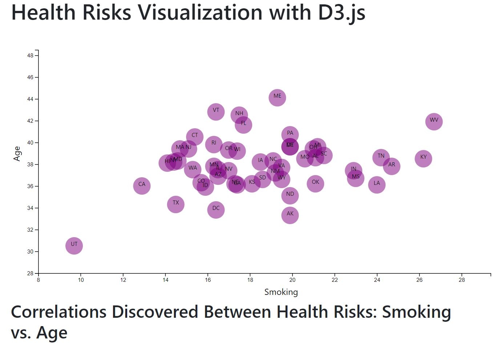

# Health Risks with D3.js

# Data Journalism and D3

## Background

I am tasked with creating visualizations that illustrate population health risks and demographics using information from the U.S. Census Bureau and the Behavioral Risk Factor Surveillance System the The data set used in the analysis is based on 2014 ACS 1-year estimates: [https://factfinder.census.gov/faces/nav/jsf/pages/searchresults.xhtml](https://factfinder.census.gov/faces/nav/jsf/pages/searchresults.xhtml). The current data set incldes data on rates of income, obesity, poverty, etc. by state. MOE stands for "margin of error."

## The Task

### D3 Dabbler

Created a scatter plot between two of the data variables such as `Smoking and Age`.

Using D3 techniques, a scatter plot was created that represents each state with circle elements. 

* Included state abbreviations in the circles.

* Created and situated your axes and labels to the left and bottom of the chart.

### 2. Incorporated d3-tip

Entered tooltips: this was implemented in the D3 graphics as the user hovers over each element.

### Visualization

